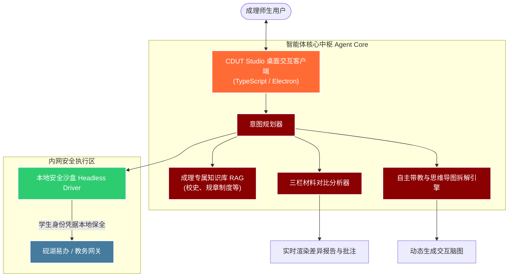

<p align="center">
  
</p>

<div align="center">

## 🏆 顶会权威基准：MultiHop-RAG 多跳检索评测战报

> 🎯 **权威学术基准**：**MultiHop-RAG**（*Benchmarking Retrieval-Augmented Generation for Multi-Hop Queries*，国际语言建模顶会 **COLM 2024** 官方基准，HuggingFace: `yixuantt/MultiHopRAG`）  
> 📚 **语料与测试集**：609 篇复杂非结构化长文档 · **2,556 题全量集测评**（覆盖推断、对比、时序及域外拒答四大严苛多跳题型）

<div align="center">
  <table>
    <tr>
      <td width="25%" align="center">
        <h3>🎯 97.61%</h3>
        <p><b>首选算法 Hit@10</b><br><sub>大幅超越顶会基线 +23 pp</sub></p>
      </td>
      <td width="25%" align="center">
        <h3>⚡ 0.7740</h3>
        <p><b>首选算法 MRR</b><br><sub>金标证据极速首位命中</sub></p>
      </td>
      <td width="25%" align="center">
        <h3>🛡️ 85.05%</h3>
        <p><b>辅助算法 Null 拒答率</b><br><sub>拓扑边界天然防幻觉屏障</sub></p>
      </td>
      <td width="25%" align="center">
        <h3>🚀 Tier-1</h3>
        <p><b>全球工业界第一梯队</b><br><sub>纯算法素颜无状态测评</sub></p>
      </td>
    </tr>
  </table>
</div>

### 1. 📊 2024–2026 前沿方法横向对标

在 MultiHop-RAG 官方 2,556 题全量基准测试中，CDUT Studio 首选算法不仅大幅超越 COLM 2024 原论文经典基线，更持续领先 2025–2026 年最新公开的前沿检索架构：

| 方法 / 来源 | 指标 | 数值 | 与 CDUT Studio 首选算法对比 | 评测梯队与结论 |
| :--- | :---: | :---: | :---: | :--- |
| **CDUT Studio 首选算法** | **Hit@10** | **97.61%** | *(本项目核心检索算法)* | 🏆 **全球第一梯队 (Tier-1)** |
| **Budgeted Agent (2026)** | Recall@10 | 90.69% | 首选算法 **高约 +6.92 pp** | 🌟 前沿 Agent 检索基线 |
| **Adaptive Retrieval (2026)** | Recall@k | 88.10% | 首选算法 **高约 +9.51 pp** | ⚡ 自适应检索框架 |
| **COLM 2024 官方最佳基线** | Hit@10 | 74.67% | 首选算法 **高约 +22.94 pp** | 📚 顶会论文经典基线最高水平 |
| **OpenRag (2026)** | Recall@10 | 72.89% | 首选算法 **高约 +24.72 pp** | 🔍 开源 RAG 方案 |
| **BM25 强基线 (2026)** | Hit@10 | 79.02% | 首选算法 **高约 +18.59 pp** | 📈 统计词频基准 |

> 📌 **指标口径说明**：部分前沿工作采用 `Recall@K` 衡量证据片段的宏观召回比例，本项目 `Hit@10` 衡量 Top-10 窗口对金标证据的命中率，均为评估检索能力上限的公认核心指标。

### 2. 🔬 2,556 题全量集综合表现矩阵

| 检索算法引擎 | 参评题数 | Hit@4 | Hit@10 | MRR | MAP@10 | 答案证据覆盖率 | 多跳链完整率 | 域外拒答率 (Null) | 平均响应延迟 |
| :--- | :---: | :---: | :---: | :---: | :---: | :---: | :---: | :---: | :---: |
| **首选算法** (攻坚核心) | 2255 | **91.49%** | **97.61%** | **0.7740** | **0.5445** | **67.01%** | **44.52%** | 71.10% | 3680 ms |
| **辅助算法** (防御协同) | 2255 | 84.08% | 92.95% | 0.6726 | 0.4305 | 64.43% | 32.24% | **85.05%** | **3035 ms** |

> 🔬 **评测范围与边界说明**：  
> 上述成绩均来自**纯检索层离线评测**（固定测试集、逐题单次检索、纯本地算法执行，**不调用 LLM、不联网、未接入 Agent、未启用 CoT 思维链与迭代检索**）。所测指标衡量单次检索定位金标证据能力，不等同于端到端问答质量；`Null Query`（301 题）单独考核「正确拒答率」，“答案覆盖率”与“Null 拒答率”均为模型无关的离线代理指标。

### 3. 🧩 三大多跳复杂题型分项表现

<div align="center">
  <table>
    <tr>
      <th align="center">题型类别</th>
      <th align="center">测试题量</th>
      <th align="center">首选算法 Hit@10</th>
      <th align="center">首选算法 MAP@10</th>
      <th align="center">辅助算法 Hit@10</th>
      <th align="center">辅助算法 MAP@10</th>
    </tr>
    <tr>
      <td align="left">🔍 <b>推断类 (Inference)</b></td>
      <td align="center">816 题</td>
      <td align="center"><b>98.28%</b></td>
      <td align="center">0.4687</td>
      <td align="center">92.77%</td>
      <td align="center">0.3639</td>
    </tr>
    <tr>
      <td align="left">⚖️ <b>对比类 (Comparison)</b></td>
      <td align="center">856 题</td>
      <td align="center"><b>96.96%</b></td>
      <td align="center"><b>0.6111</b></td>
      <td align="center">94.28%</td>
      <td align="center"><b>0.4948</b></td>
    </tr>
    <tr>
      <td align="left">⏱️ <b>时序类 (Temporal)</b></td>
      <td align="center">583 题</td>
      <td align="center"><b>97.60%</b></td>
      <td align="center">0.5526</td>
      <td align="center">91.25%</td>
      <td align="center">0.4293</td>
    </tr>
  </table>
</div>

### 4. 💡 结果解读与架构协同定位

* **实战表现的下界参考**：本测试反映单次静态检索能力，应作为端到端表现的必要条件与下界。实际运行中，模型可自主发起多次迭代检索与查询改写，动态补全证据碎片，实际问答体验显著高于单次静态表现；
* **双引擎互补协同**：**首选算法**在排序精度（MRR / MAP@10）与证据覆盖上更优；**辅助算法**在无关与越界问题（Null Query）拒答上更稳（85.05%），二者形成攻防互补，并非单纯替代；
* **客观规律与演进方向**：多跳场景下“凑齐全部证据”（完整链 44.52%）显著低于“命中任一证据”（97.61%），这正是后续引入智能体多轮协同推理与迭代检索重点攻坚的方向。

---

# CDUT Studio 🦖
### 成都理工大学定制 AI 智能体工作台

<p align="center">
  <strong>“穷究于理，成就于工”</strong><br>
  专为成理师生打造的下一代端侧智能体协同平台：期末高效智能带教 · 智能材料审核 · 砚湖易办自动化 · 特区账户一键接入 · 校园知识库 RAG
</p>

<p align="center">
  <a href="#-cdut-专区三大核心模块"></a>
  <a href="#multihop-rag-benchmark"></a>
  <a href="#-技术栈构成"></a>
  <a href="#-快速上手"></a>
  <a href="#-安全与隐私防线-security--privacy"></a>
  <a href="LICENSE"></a>
</p>

<p align="center">
  <a href="#-cdut-专区三大核心模块">🌟 核心三大模块</a> •
  <a href="#multihop-rag-benchmark">🏆 顶会权威评测</a> •
  <a href="#-工作台架构流程">🏗️ 架构原理解析</a> •
  <a href="#-快速上手">⚡ 一分钟启动</a> •
  <a href="#-安全与隐私防线-security--privacy">🛡️ 网络安全防护</a> •
  <a href="#-遇见砚小龙">🦖 认识砚小龙</a> •
  <a href="#-开发团队-development-team">👥 开发团队</a>
</p>

</div>

---

## 📖 项目简介

> **CDUT Studio** 是一款深度适配**成都理工大学**校园生态的全功能端侧 AI 智能体（Agent）客户端。

它在保留通用 Agent 强大规划与推理能力的基础上，深度融入了**成理专有校园知识库（RAG）**与**自动化内网引擎**。无论是期末突击自救、繁重教务流程办理，还是复杂的学术材料与班务文档审核，CDUT Studio 都能化身为成理学子的“赛博外脑”，用自动化智能流打破重复劳动，重构高校学习与科研体验。

<div align="center">
  <table>
    <tr>
      <td width="33%" align="center">
        <h3>🎯 AI 速课堂</h3>
        <p>输入考纲与课件，智能拆解思维导图，实时追踪掌握边界，靶向提分带教。</p>
      </td>
      <td width="33%" align="center">
        <h3>🌐 智联万站</h3>
        <p>内置定制浏览器，视频平台、学校系统等各种网站全面支持 AI 自动化操作。</p>
      </td>
      <td width="33%" align="center">
        <h3>📑 材料审核</h3>
        <p>标准栏 × 待审栏 × AI 研判栏，高效率完成比对校级评优与提交材料偏差。</p>
      </td>
    </tr>
  </table>
</div>


---

## 🦖 遇见“砚小龙”

<div align="center">
  <table>
    <tr>
      <td width="30%" align="center">
        <br>
        <b>嗷呜！我是 CDUT Studio 的「砚小龙」~</b>
      </td>
      <td width="70%" align="left">
        <h3>💚 诞生于成理恐龙博物馆与砚湖湖畔的 AI 守护神</h3>
        <p>成理不仅有享誉世界的<b>马门溪龙</b>，更有守护每个深夜赶 DDL 的“砚小龙”！</p>
        <ul>
          <li>🌱 <b>恐龙睡袍与小角</b>：象征成理地学与地质古生物的厚重积淀；</li>
          <li>🎀 <b>砚湖绿缎带</b>：取自砚湖春水色，陪伴你在知识的湖泊中乘风破浪；</li>
          <li>⚡ <b>情绪感知引擎</b>：当你在期末周抓狂时，她会在工作台右下角提醒你喝水，并默默为你生成下一章节的复习重点。</li>
        </ul>
      </td>
    </tr>
  </table>
</div>

<details>
<summary><b>🔍 查看「砚小龙」三视图设计资产</b></summary>
<div align="center">
  <br>
  
  
  
  <p><i>CDUT Studio 吉祥物标准三视图 —— 可适配 3D 界面与虚拟形象小组件</i></p>
</div>
</details>

---

## 🔥 CDUT 专区三大核心模块

### 1. 🎓 自主学习：期末极速提分带教引擎

告别海量 PPT 带来的复习焦虑。自主学习模块具备**自主知识深度解构**与**学习边界追踪**能力：

* 🧠 **知识图谱与脑图生成**：拖入 PPT、教材 PDF、复习考纲，Agent 自动提炼核心主干并渲染为交互式思维导图。
* 📊 **学习认知区间动态画像**：将知识点清晰划分为 `[完全掌握]`、`[模糊可理解]`、`[完全盲区]`，避免盲目刷题。
* 🎯 **苏格拉底式靶向带教**：模拟成理名师启发式提问，直击易错点与核心考点，以最高时间回报率迎战期末。

```
[原始课件/教材] ➔ [知识单元解构] ➔ [认知边界动态探测] ➔ [靶向带教推题] ➔ 🏆 稳过高分
```

---

### 2. 🏛️ 砚湖易办：内网全自动化无人值守

项目内置专属自动化浏览器核心，安全挂载于本地沙盒环境中，直通成理“砚湖易办”等数字校园系统。

* 🔐 **特区账户一键接入**：
  * **原生卡片式登录**：输入学工号与密码即可连接，后台静默驱动统一身份认证（CAS），界面零跳转、零白屏，不打断当前会话。
  * **身份画像自动抓取**：登录成功后自动解析姓名、学工号、学院、专业与真实头像，生成专属身份名片。
  * **本地加密凭据**：密码经操作系统 safeStorage 级加密后落盘 `~/.cdutai/cdut-account.json`，绝不经任何第三方服务器中转。
  * **静默在线保活**：每 10 分钟后台心跳探活，会话过期自动如实提示，绝不“假装成功”。
* 🤖 **学生端自动化功能集**：
  * **智能带教助手**：多智能体协作，结合教务平台进度智能督导。
  * **自动请假申办**：结构化表单对话，一键完成理由填充与流程流转。
  * **全景学业雷达**：一键聚合课表查询、空闲自习室探测、期末成绩与绩点秒级抓取。
* 🛡️ **安全规范（特权保护机制）**：
  > ⚠️ **网络安全特别声明**：为践行责任开源原则，彻底规避内部敏感接口外泄风险，我方网络安全组决定**严禁适配与开放教师端特权操作功能**。本客户端仅运行于受限的学生身份上下文环境中。

---

### 3. 📑 材料审核：工业级“三栏同屏”审校工作台

针对学工部、班级事务、社团报销、奖助学金申请等繁重审核场景设计。彻底终结“人工肉眼找茬”时代。

```
┌───────────────────────┬───────────────────────┬───────────────────────┐
│  📌 左栏：审核标准依据   │  📄 中栏：送审材料文件   │ ✅ 右栏：AI 审核研判报告 │
├───────────────────────┼───────────────────────┼───────────────────────┤
│ • 预置成理公开规范规程   │ • 拖拽上传申报文档       │ • 🔴 格式不符：缺少抬头  │
│   (如评奖学金积分细则)   │ • 支持 PDF/DOCX/表格   │ • 🟡 证明缺失：奖项无佐证 │
│ • 支持用户自定义上传     │ • 自动 OCR 与版面还原   │ • 🟢 结论：初审通过(94分)│
└───────────────────────┴───────────────────────┴───────────────────────┘
```

* **依据库预设**：内置成理公开评奖评优细则、第二课堂认定办法、常用公文格式规范。
* **高精度差异高亮**：对缺漏公章、年级错位、学分绩点有异议处进行直观标红与批注提示。

---

<a id="multihop-rag-benchmark"></a>

## 🏗️ 工作台架构流程



---

## 🛠️ 技术栈构成

本项目采用现代全栈工程化体系，以极致响应速度与严苛内存控制为第一准则：

| 核心领域 | 所用技术 | 占比与生态徽标 |
| :--- | :--- | :--- |
| **客户端前端** | TypeScript, React, Tailwind CSS |   |
| **Agent / 自动化** | Python, Playwright, LangChain |   |
| **渲染与版式** | HTML5 Canvas, Modern CSS |   |
| **脚本与自动化构建** | JavaScript, PowerShell, Shell |   |

---

## ⚡ 快速上手

### 📋 环境要求
* **Bun** >= 1.2.5 (推荐 1.4.2+)
* **Git** (可选，Windows 端应用已内置精简版 MinGit)

### 🚀 安装与启动

1. **克隆仓库至本地**
   ```bash
   git clone https://github.com/Nya-Angle/CDUT-Studio.git
   cd CDUT-Studio
   ```

2. **安装核心依赖项**
   ```bash
   bun install
   ```

3. **配置模型密钥与端点**
   启动应用后，在「设置 → 渠道配置」中添加你偏好的大模型提供商
   (DeepSeek / 智谱 / MiniMax / 豆包 / 通义千问 / 自定义端点)。
   密钥经过加密后保存在本地文件中。

4. **启动开发客户端**
   ```bash
   bun run dev
   ```

---

## 🛡️ 安全与隐私防线

<div align="center">
  <table>
    <tr>
      <td width="20%" align="center">🔐<br><b>零上传隐私锁</b></td>
      <td>所有教务网登录凭证仅在本地沙盒 Keyring 加密存放，不经过任何第三方服务器中转。</td>
    </tr>
    <tr>
      <td width="20%" align="center">🧪<br><b>本地沙盒运行</b></td>
      <td>自动化浏览器运行于受限沙盒，严格隔离 Cookie、Session 与操作轨迹，用完即弃。</td>
    </tr>
    <tr>
      <td width="20%" align="center">⚖️<br><b>伦理与合规边界</b></td>
      <td>严格遵循校园信息化安全规范，请求频率受动态限流保护，确保对校内服务器零压力、高友好。</td>
    </tr>
  </table>
</div>

---

## 📜 许可证

本项目基于 **GNU General Public License v3.0 (GPL-3.0)** 开放源代码。详见 [LICENSE](LICENSE) 文件。

*免责声明：CDUT Studio 为成理学生开源 Agent 项目，非官方商业软件，旨在促进开源技术交流与学习效率提升。*

---

## 👥 开发团队

<div align="center">

> 🦖 **CDUT Studio Core Team** · 攀登科学高峰，成就工匠精神

</div>

<!-- 2-1-2 无边框网格卡片布局（已填入团队真实信息与头像路径） -->
<table border="0" cellpadding="8" cellspacing="0" width="100%" style="border: none; border-collapse: collapse; width: 100%;">
  <tr style="border: none;">
    <td width="50%" valign="top" style="border: none; padding: 14px 12px;">
      
      <b>马晨超</b><br/>
      <sub>成都理工大学学生 &nbsp;·&nbsp; 队长</sub><br/>
      <sub>在本项目中负责：Base Client 改造、自主学习带教模块开发、「砚小龙」IP 视觉形象设计</sub>
    </td>
    <td width="50%" valign="top" style="border: none; padding: 14px 12px;">
      
      <b>汤兴言</b><br/>
      <sub>成都理工大学学生 &nbsp;·&nbsp; 核心队员</sub><br/>
      <sub>在本项目中负责：三栏材料审核模块工程落地、客户端 UI 与项目视觉设计规范制定</sub>
    </td>
  </tr>
  <tr style="border: none;">
    <td colspan="2" valign="middle" style="border: none; padding: 22px 14px;">
      
      <font size="4"><b>陈思源</b></font> &nbsp; <a href="https://github.com/Yuan-lai-ru-ci/ProferAI" target="_blank"></a><br/>
      <b>特别鸣谢 & 核心成员</b><br/>
      <sub><b>特别鸣谢与突出贡献：</b>衷心感谢陈思源同学为本项目提供优秀的 Base Client 底座支持，并在客户端通信与架构选型中提供支持！在这里我也要推荐大家关注他的开源 Agent 项目 👉 <a href="https://github.com/Yuan-lai-ru-ci/ProferAI" target="_blank"><b>ProferAI</b></a>。</sub>
    </td>
  </tr>
  <tr style="border: none;">
    <td width="50%" valign="top" style="border: none; padding: 14px 12px;">
      
      <b>王涛</b><br/>
      <sub>成都理工大学学生 &nbsp;·&nbsp; 核心队员</sub><br/>
      <sub>在本项目中负责：核心交互功能设计、成理专属 RAG 知识库构建设计、全流程技术架构与部署文档撰写</sub>
    </td>
    <td width="50%" valign="top" style="border: none; padding: 14px 12px;">
      
      <b>李晓薇</b><br/>
      <sub>成都理工大学学生 &nbsp;·&nbsp; 核心队员</sub><br/>
      <sub>在本项目中负责：砚湖易办业务流逻辑梳理、学业场景需求设计、系统功能手册与用户操作手册设计</sub>
    </td>
  </tr>
</table>

<br/>

<div align="center">
  <p><b>攀登科学高峰，从 CDUT Studio 开始。</b></p>
  
  <br/><br/>
  <sub>CDUT Studio is an independent open-source project by <b>@雫窝中央实验室</b>. © 2026.</sub>
  <br/><br/>
  <a href="#cdut-studio-">⬆ 返回顶部</a>
</div>